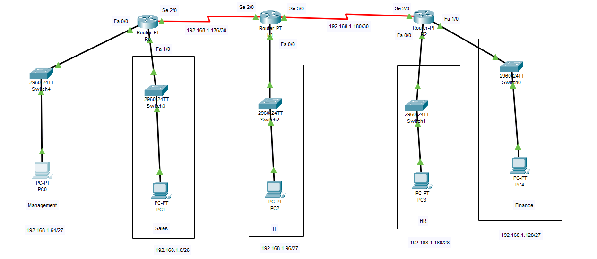
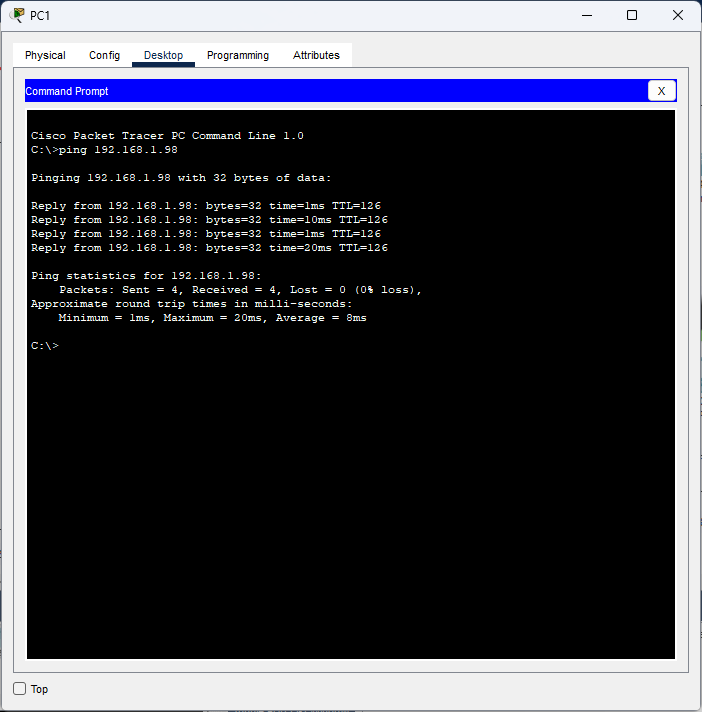

# **Lab Report: VLSM IP Addressing Implementation**  

---

## **1. Introduction**  
**Variable Length Subnet Mask (VLSM)** allows efficient IP address allocation by using different subnet masks for different subnets within the same network. This lab demonstrates VLSM design for a company with departments requiring varying host sizes.  

**Assigned Network:** `192.168.1.0/24`  

---

## **2. Lab Scenario**  
### **Department Requirements**  
| Department   | Hosts Required |  
|--------------|----------------|  
| Sales        | 60             |  
| Management   | 30             |  
| IT           | 20             |  
| Finance      | 15             |
| HR           | 10             |  
| Router Links | 2 (each)       |  

---

## **3. VLSM Addressing Plan**  
### **Subnet Calculation**
Subnets were allocated based on host requirements (using `2^n - 2 ≥ hosts`):  
| Subnet         | Hosts Needed | Subnet Mask      | Network Address   | Usable Range               | Broadcast     |  
|----------------|--------------|------------------|-------------------|----------------------------|---------------|  
| Sales          | 60           | `/26` (255.255.255.192) | `192.168.1.0`    | `192.168.1.1` - `192.168.1.62`  | `192.168.1.63` |  
| Management     | 30           | `/27` (255.255.255.224) | `192.168.1.64`   | `192.168.1.65` - `192.168.1.94` | `192.168.1.95` |  
| IT             | 20           | `/27` (255.255.255.224) | `192.168.1.96`   | `192.168.1.97` - `192.168.1.126` | `192.168.1.127` |  
| Finance    | 15       | `/27` (255.255.255.224) | `192.168.1.128` | `192.168.1.129` - `192.168.1.158` | `192.168.1.159` |  
| HR             | 10           | `/28` (255.255.255.240) | `192.168.1.160`  | `192.168.1.161` - `192.168.1.174` | `192.168.1.175` |  
| R0-R1    | 2            | `/30` (255.255.255.252) | `192.168.1.176`  | `192.168.1.177` - `192.168.1.178` | `192.168.1.179` |  
| R1-R2     | 2            | `/30` (255.255.255.252) | `192.168.1.180`  | `192.168.1.181` - `192.168.1.182` | `192.168.1.183` |  


---

## **4. Device Configuration**  
### **Router Interfaces**  
| Device  | Interface         | IP Address       | Subnet Mask       |  
|---------|-------------------|------------------|-------------------|  
| R0 | FastEthernet0/0   | `192.168.1.65`   | `255.255.255.224` | *(Management)* |  
|         | FastEthernet0/1   | `192.168.1.1`  | `255.255.255.192` | *(Sales)* |  
|         | Serial2/0         | `192.168.1.177`  | `255.255.255.252` | *(R0-R1 Link)* |  
| R1 | FastEthernet0/0   | `192.168.1.97`   | `255.255.255.224` | *(IT)* |  
|         | Serial2/0         | `192.168.1.178`  | `255.255.255.252` | *(R1-R0 Link)* |  
|         | Serial3/0         | `192.168.1.181`  | `255.255.255.252` | *(R1-R2 Link)* |  
| R2 | FastEthernet0/0   | `192.168.1.161`  | `255.255.255.240` | *(HR)* |  
|  | FastEthernet0/1   | `192.168.1.129`  | `255.255.255.224` | *(Finance)* |  
|  | Serial2/0   | `192.168.1.182`  | `255.255.255.252` | *(R2-R1 Link)* |  


### **Static Routing (Example)**  
```
Router0(config)# ip route 192.168.1.96 255.255.255.224 192.168.1.178  # Route to IT
Router1(config)# ip route 192.168.1.0 255.255.255.192 192.168.1.177   # Route to Sales
```

---

## **5. Verification**  
- **Ping Test:**  
  ```cmd
  PC1> ping 192.168.1.98  # (from Sales Department to IT Department)
    Pinging 192.168.1.98 with 32 bytes of data:
    
    Reply from 192.168.1.98: bytes=32 time=1ms TTL=126
    Reply from 192.168.1.98: bytes=32 time=1ms TTL=126
    Reply from 192.168.1.98: bytes=32 time=11ms TTL=126
    Reply from 192.168.1.98: bytes=32 time=22ms TTL=126
    
    Ping statistics for 192.168.1.98:
        Packets: Sent = 4, Received = 4, Lost = 0 (0% loss),
    Approximate round trip times in milli-seconds:
        Minimum = 1ms, Maximum = 22ms, Average = 8ms
  ```

---

## **6. Screenshots**  



---

## **7. Conclusion**  
VLSM efficiently allocated IPs to departments with minimal waste. The network was verified using static routing and ping tests.


**Files Included:**  
- `Lab1_Report.md` (This report)
- `vlsm_topology.pkt` (Packet Tracer file)
- `/screenshots` (Verification evidence)  

