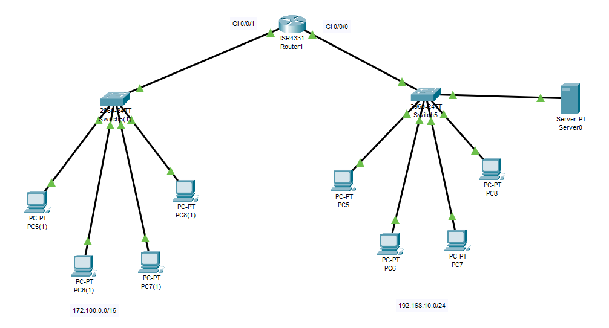
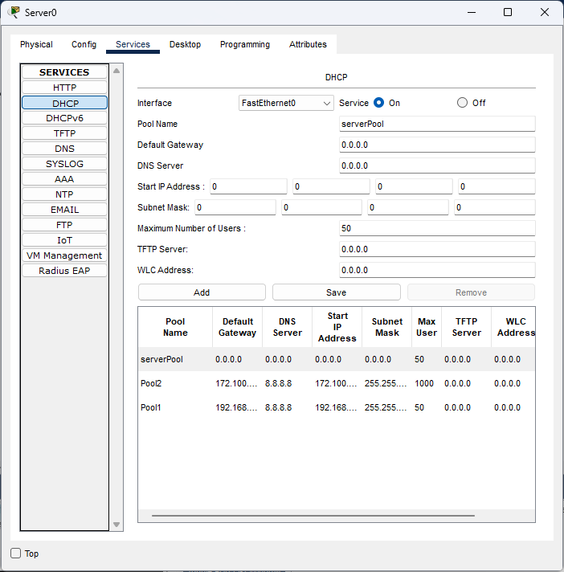
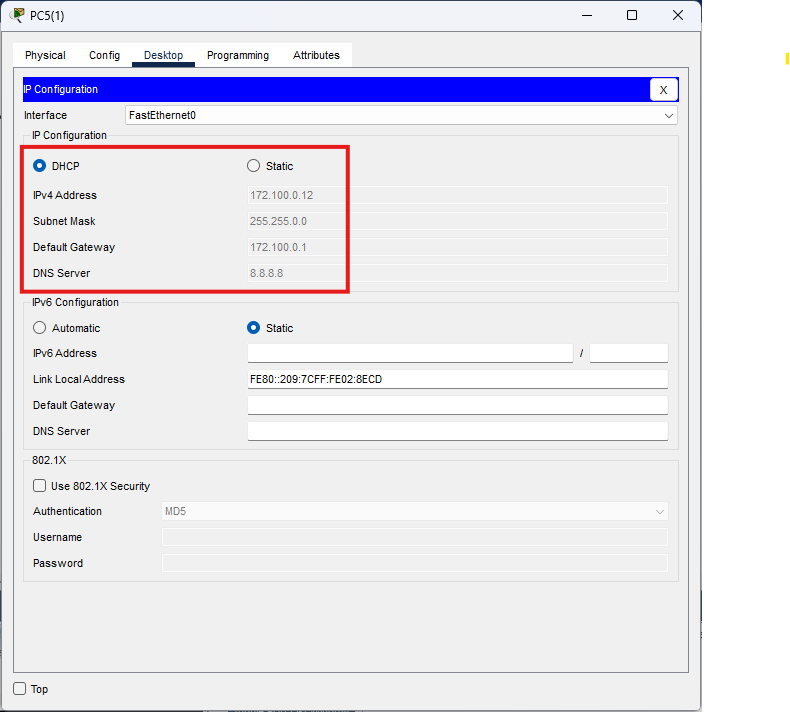
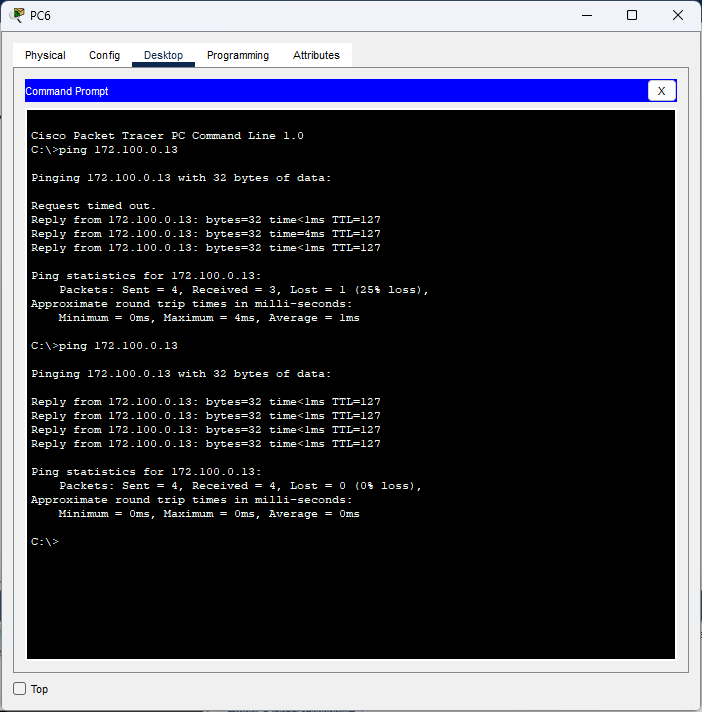

# **Lab Report: DHCP Server Configuration**  
---

## **1. Introduction**  
This lab demonstrates **DHCP (Dynamic Host Configuration Protocol)** server setup in Cisco Packet Tracer to automatically assign IP addresses across two subnets (`192.168.10.0/24` and `172.100.0.0/16`), including router relay agent configuration.

---

## **2. Lab Topology**  
  
---

## **3. DHCP Server Configuration**  
**Steps:**  
1. Enabled DHCP service on server  
2. Created pools with respective parameters  
### **DHCP Pools**  
| Pool  | Subnet           | Gateway       | DNS     | IP Range            | Max Users |  
|-------|------------------|---------------|---------|---------------------|-----------|  
| Pool1 | `192.168.10.0/24` | `192.168.10.1` | `8.8.8.8` | `192.168.10.10-192.168.10.59`  | 50        |  
| Pool2 | `172.100.0.0/16`  | `172.100.0.1`  | `8.8.8.8` | `172.100.0.10-172.100.255.254` | 1000      |  


---

## **4. Router as DHCP Relay Agent**  
Configured Router0 to forward DHCP requests to `192.168.1.2`:  
```bash
Router(config)# interface GigabitEthernet0/0  
Router(config-if)# ip helper-address 192.168.1.2  
Router(config-if)# exit  
Router(config)# interface GigabitEthernet0/1  
Router(config-if)# ip helper-address 192.168.1.2  
```

---

## **5. Client Configuration**  
- Set PCs to **DHCP** mode in IP Configuration  
- **Verification:**  
  ```bash
  PC2> ipconfig  
  FastEthernet0 Connection:(default port)

   Connection-specific DNS Suffix..: 
   Link-local IPv6 Address.........: FE80::201:C7FF:FE87:1D43
   IPv6 Address....................: ::
   IPv4 Address....................: 172.100.0.13
   Subnet Mask.....................: 255.255.0.0
   Default Gateway.................: ::
                                     172.100.0.1
    ```
    ```bash
  PC5> ipconfig  
  FastEthernet0 Connection:(default port)

   Connection-specific DNS Suffix..: 
   Link-local IPv6 Address.........: FE80::203:E4FF:FE0E:C91
   IPv6 Address....................: ::
   IPv4 Address....................: 192.168.10.15
   Subnet Mask.....................: 255.255.255.0
   Default Gateway.................: ::
                                     192.168.10.1
  ```

---

## **6. Connectivity Tests**  
- Successful pings between subnets:  
  ```bash
  PC5> ping 172.100.0.13
  Pinging 172.100.0.13 with 32 bytes of data:

    Reply from 172.100.0.13: bytes=32 time<1ms TTL=127
    Reply from 172.100.0.13: bytes=32 time<1ms TTL=127
    Reply from 172.100.0.13: bytes=32 time<1ms TTL=127
    Reply from 172.100.0.13: bytes=32 time<1ms TTL=127
    
    Ping statistics for 172.100.0.13:
        Packets: Sent = 4, Received = 4, Lost = 0 (0% loss),
    Approximate round trip times in milli-seconds:
        Minimum = 0ms, Maximum = 0ms, Average = 0ms
  ```
- DHCP server logs confirmed IP assignments.  

---

## **7. Screenshots**  
1.   
2.   
3.   

---

## **8. Conclusion**  
- Successfully implemented a multi-subnet DHCP server with relay functionality.  
- Demonstrated automatic IP assignment and cross-subnet connectivity.  
- DHCP reduces manual IP configuration 
- Relay agents enable centralized DHCP serving  

**Files Included:**  
- `Lab2_Report.md` (This report)  
- `dhcp_topology.pkt`  
- `/screenshots` (Configuration evidence)  
