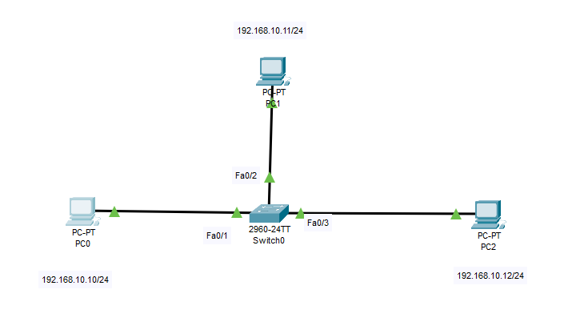
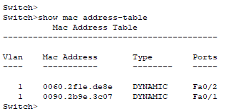
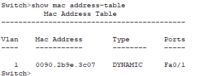

# **Lab Report: Switching and ARP Basics**  
---

## **1. Introduction**  
This lab explores fundamental switching concepts (MAC learning, forwarding, flooding) and ARP protocol operation using Cisco Packet Tracer. The topology consists of 3 PCs connected to a 2960 switch.

---

## **2. Lab Topology**  
  
---

## **3. Addressing Table**  
| Device | IP Address      | MAC Address       |  
|--------|-----------------|-------------------|  
| PC0    | 192.168.10.11   | `0090.2B9E.3C07` |  
| PC1    | 192.168.10.12   | `0060.2F1E.DE8E` |  
| PC2    | 192.168.10.13   | `0090.21BE.8992` |  

---

## **4. Switch Functions**  
### **A. MAC Learning**  
1. Sending ping from PC0 to PC1:  
   ```bash
   PC0> ping 192.168.10.11
   ```
2. Verifying MAC table with:  
   ```bash
   SW1# show mac address-table
   ```
   **Result:**  
   | Port  | MAC Address       |  
   |-------|-------------------|  
   | Fa0/1 | `0090.2B9E.3C07` |  
   | Fa0/2 | `0060.2F1E.DE8E` |  
   
     

### **B. Forwarding**  
- Switch forwards the frames **only to PC1** (port Fa0/2) after learning MAC addresses.

### **C. Flooding**  
- When PC1 is disconnected, the switch floods ARP requests to **all ports except Fa0/1**.  
- Clearing MAC table with:  
  ```bash
  SW1# clear mac address-table dynamic
  ```
  After pinging **PC1** again, the MAC Address table will be like this:
  
   | Port  | MAC Address       |  
   |-------|-------------------|  
   | Fa0/1 | `0090.2B9E.3C07` |  
   
     

---

## **5. ARP Process**  
1. Clearing ARP caches on all PCs:  
   ```bash
   PC> arp -d
   ```
2. Sent ping from PC0 to PC1 and observed:  
    - PC0 sends an ARP request to resolve the MAC address of 192.168.1.11.
    - PC1 responds with its MAC address.
    - PC0 updates its ARP table with PC1's MAC address.  
3. Verifying ARP table on PC0:  
   ```bash
   PC0> arp -a
   ```
   **Output:**  
   ```
   Internet Address      Physical Address      Type  
   192.168.10.11         0060.2F1E.DE8E        dynamic
   ```

---

## **6. Conclusion**  
- Demonstrated **switch learning/forwarding** by analyzing MAC tables. 
- Switches use MAC tables for efficient forwarding 
- Verified **ARP's IP-to-MAC resolution** process.  
- Observed **flooding behavior** when destination unknown.  

**Files Included:**  
- `README.md` (This report)  
- `switching_topology.pkt`  
- `/screenshots` (Evidence images)  
