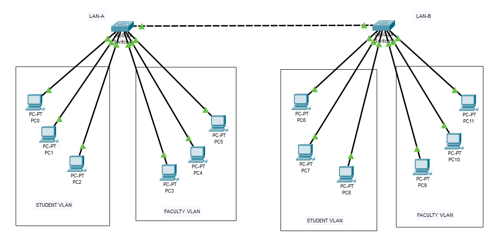
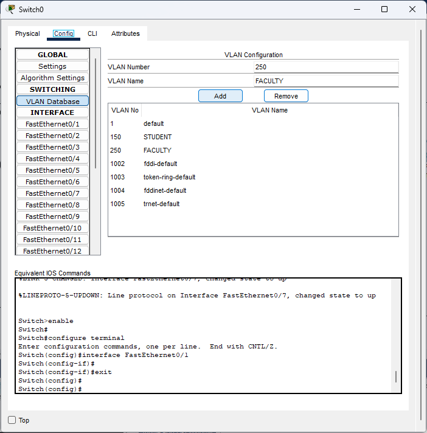
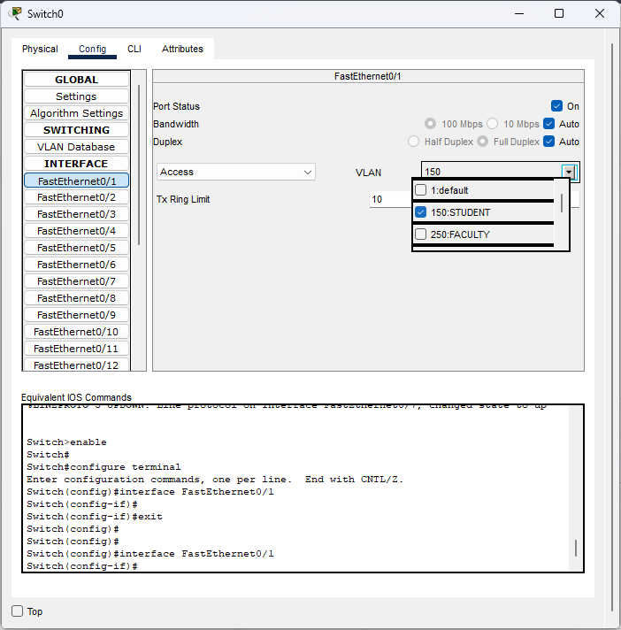
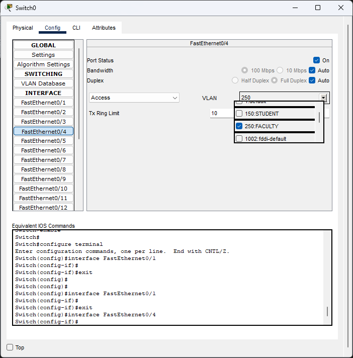
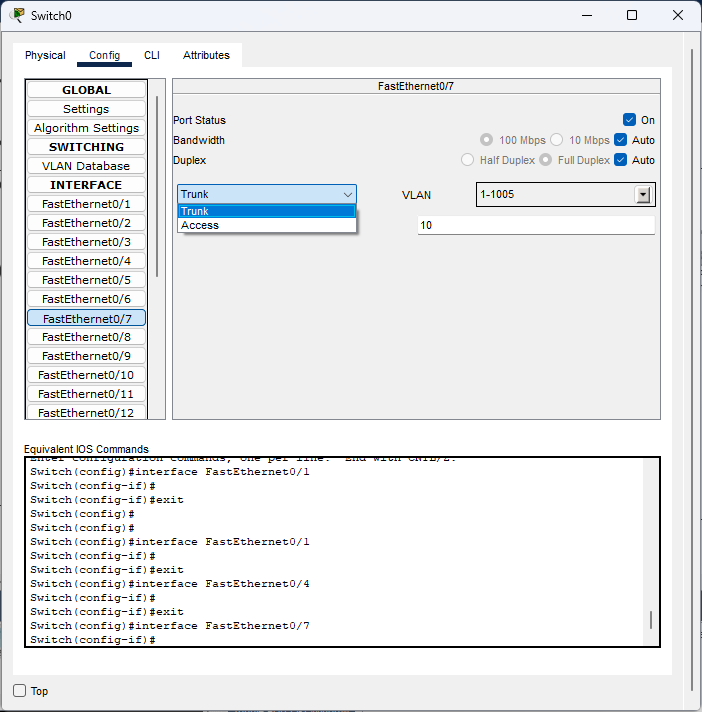
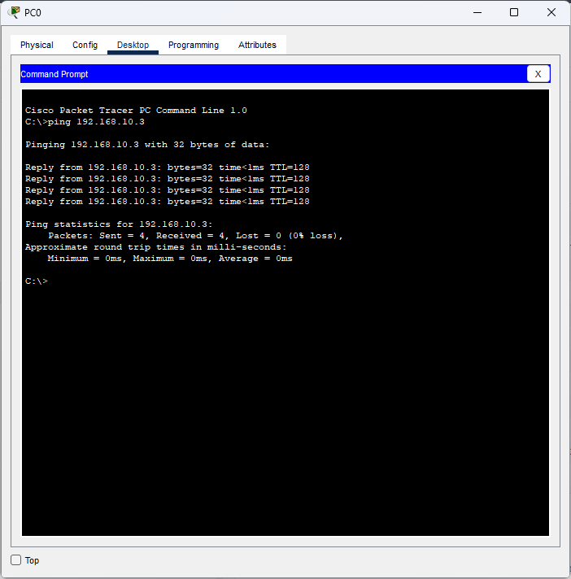
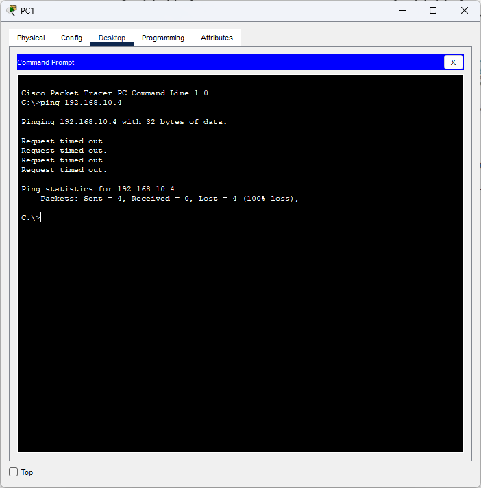

# **Lab Report: VLAN Configuration**
---

## **1. Introduction**  
This lab demonstrates VLAN implementation on a Layer 2 switch in Cisco Packet Tracer, segregating a LAN into **VLAN-STUDENT** and **VLAN-FACULTY** groups for improved network management and security.

---

## **2. Lab Topology**  
  
---

## **3. Configuration Steps**  

### **A. VLAN Setup**  
1. Created VLANs in Switch0:  
 
   ```bash
   Switch# vlan database
   Switch(vlan)# vlan 150 name STUDENT
   Switch(vlan)# vlan 250 name FACULTY
   ```

2. Assigned ports:  
   | Port    | VLAN    | Host IP        |  
   |---------|---------|----------------|  
   | Fa0/1-3 | 150     | 192.168.10.1-192.168.10.3 |  
   | Fa0/4-6 | 250     | 192.168.10.4-192.168.10.6 |  

    
    

3. Configured trunk port:  
   ```bash
   Switch(config)# interface FastEthernet0/7
   Switch(config-if)# switchport mode trunk
   ```
   

---

## **4. Verification**  
1. **Intra-VLAN Communication:**  
   - Successful ping within VLAN-STUDENT:  
     ```bash
     PC0> ping 192.168.10.3  # (VLAN 150)
     Pinging 192.168.10.3 with 32 bytes of data:

        Reply from 192.168.10.3: bytes=32 time<1ms TTL=128
        Reply from 192.168.10.3: bytes=32 time<1ms TTL=128
        Reply from 192.168.10.3: bytes=32 time<1ms TTL=128
        Reply from 192.168.10.3: bytes=32 time<1ms TTL=128
        
        Ping statistics for 192.168.10.3:
            Packets: Sent = 4, Received = 4, Lost = 0 (0% loss),
        Approximate round trip times in milli-seconds:
            Minimum = 0ms, Maximum = 0ms, Average = 0ms
     ```
     
     

2. **Inter-VLAN Isolation:**  
   - Failed ping between VLANs (expected behavior):  
     ```bash
     PC1> ping 192.168.10.4  # (VLAN 150 to VLAN 250)
     Pinging 192.168.10.4 with 32 bytes of data:
        
        Request timed out.
        Request timed out.
        Request timed out.
        Request timed out.
        
        Ping statistics for 192.168.10.4:
            Packets: Sent = 4, Received = 0, Lost = 4 (100% loss),
     ```
     


---

## **5. Conclusion**  
This lab successfully demonstrated VLAN segmentation, isolating broadcast domains between student and faculty groups while enabling communication within each VLAN. The trunk port configuration prepares the network for scalable multi-switch VLAN extension. Future work could implement inter-VLAN routing using a Layer 3 switch or router.

**Files Included:**  
- `Lab4_Report.md`  
- `vlan_topology.pkt`  
- `/screenshots`  