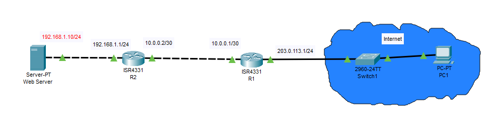
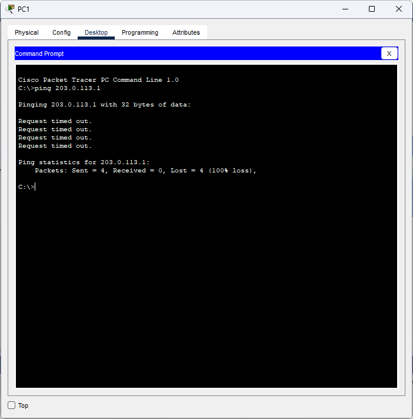

# **Lab 5 Report: Access Control Lists (ACLs)**  
---

## **Objective**  
Configure and test ACLs on Cisco routers to:  
1. Allow HTTP traffic to a web server (`192.168.1.10`).  
2. Block ICMP echo requests (pings) from the Internet while permitting other ICMP messages.  

---

## **Topology**  
  

- **R1 (Edge Router)**: Connected to the Internet (`203.0.113.1/24`) and R2 (`10.0.0.1/30`).  
- **R2 (Internal Router)**: Connects to the web server (`192.168.1.1/24`).  

---

## **Procedure**  

### **1. Network Configuration**  
#### **IP Addressing**  

**R1 Configuration**
```bash
R1(config)#interface GigabitEthernet0/0/0
R1(config-if)#ip address 203.0.113.1 255.255.255.0
R1(config-if)#exit
R1(config)#interface GigabitEthernet0/0/1
R1(config-if)#ip address 10.0.0.1 255.255.255.252
```
**R2 Configuration**
```bash
R2(config)#interface GigabitEthernet0/0/0
R2(config-if)#ip address 10.0.0.2 255.255.255.252
R2(config-if)#exit
R2(config)#interface GigabitEthernet0/0/1
R2(config-if)#ip address 192.168.1.1 255.255.255.0
```

#### **Routing**  
Static route on R1 to reach the web server:  
```bash
R1(config)# ip route 192.168.1.0 255.255.255.0 10.0.0.2
```
Static route on R2 to reach the Internet:
```bash
R2(config)# ip route 203.0.113.0 255.255.255.0 10.0.0.1
```

---

### **2. ACL Configuration**  
#### **Extended ACL on R1**  
```bash
R1(config)# access-list 101 deny icmp any any echo       ! Block pings
R1(config)# access-list 101 permit icmp any any         ! Allow other ICMP
R1(config)# access-list 101 permit tcp any host 192.168.1.10 eq 80  ! Allow HTTP
R1(config)# access-list 101 permit ip any any           ! Allow all else
R1(config)# interface Gig0/0
R1(config-if)# ip access-group 101 in                   ! Apply inbound
```

---

### **3. Verification**  
| **Test**               | **Command**                  | **Expected Result**       |  
|-------------------------|------------------------------|---------------------------|  
| Ping from Internet      | `ping 203.0.113.1`           | **Fail** (Blocked by ACL) |

  

---

## **Key Results**  
- Successfully blocked ICMP echo requests while permitting HTTP and other ICMP.  
- Verified ACL behavior using ping and HTTP tests.  

---

## **Conclusion**  
ACLs are critical for traffic filtering in networks. This lab demonstrated:  
- **Standard ACLs**: Filter by source IP (best placed near destination).  
- **Extended ACLs**: Filter by source/destination IP + port (best placed near source).  
- **Implicit Deny**: All ACLs end with an implicit `deny any` (requiring explicit `permit` rules).

**Files Included:**  

- `Lab5_Report.md`
- `acl.pkt`  
- `/screenshots`

